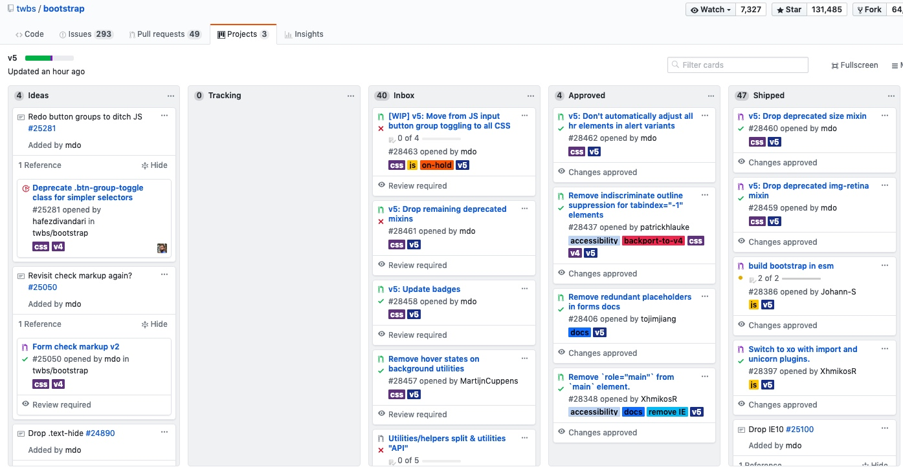
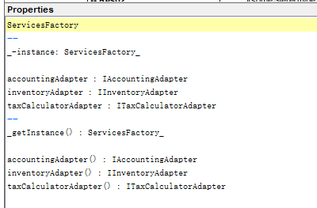

# 系统与分析第二次作业

## 用简短的语言给出对分析、设计的理解
> 分析就是对用户给出的软件功能等方面的需求进行系统的研究，识别出主要问题，确定待开发软件的**功能、性能、接口、数据、界面等**具体的细节要求.
> 
> 设计就是基于需求分析中得到的需求，构造出目标系统的逻辑模型，最终得到一个可供编码过程参考的设计模型文档.
> 
> 软件分析, 就是要确认有效的功能和需求, 不断的去满足用户的需要, 软件设计并不是一昧的去追求先进技术的应用, 而是控制变化附加的成本, 使得软件生产的预算和时间花费等能够在掌控之中.

## 用一句话描述面向对象的分析与设计的优势
> 面向对象的分析与设计能够通过分析现实世界中存在的问题，并**构建相对应的问题模型**，保持了他们的**结构、关系和行为模式**，具有易理解和易维护的特性

## 简述 UML（统一建模语言）的作用. 考试考哪些图
> UML用于**说明、可视化、构建和编写**一个**正在开发的、面向对象的、软件密集系统的**制品。 它可以将面向对象分析和面向对象设计使用统一定义的符号表示出来，并将对象自身的属性、对象与对象之间的关联关系可视化，提升项目结构的可读性。
> UML含有十多种视图，总共可以分成四类:
> * 用例图：用户角度：功能、执行者
> * 静态图：系统静态结构
>   * 类图：概念及关系
>   * 对象图：某种状态或时间段内，系统中活跃的对象及其关系
>   * 包图：描述系统的分解结构
> * 行为图：系统的动态行为
>   * 交互图：描述对象间的消息传递
>       * 顺序图：强调对象间消息发送的时序
>       * 合作图：强调对象间的动态协作关系
>   * 状态图：对象的动态行为。状态-事件-状态迁移-响应动作
>   * 活动图：描述系统为完成某功能而执行的操作序列
> * 实现图：描述系统的组成和分布状况
>   * 构件图：组成部件及其关系
>   * 部署图：物理体系结构及与软件单元的对应关系

## 从软件本质的角度，解释软件范围（需求）控制的可行性
> 软件的本质包括复杂性、一致性、可变性和不可视性.
> 
> 对于软件的需求可能会因为不一致、不可使、易于变化的环境而更改，需求的更改会带来软件的改动，这就可能会产生巨大的负面影响，包括**开发难度的增加，开发周期的增长**等。为了尽可能避免以上情况的发生，我们必须对软件需求进行范围的划定和控制。即在需求分析与设计的过程中，我们必须在给定的范围内围绕软件开发的成本进行调控，**允许范围内、不造成巨大影响的需求变更和迭代**，最终保证软件开发周期和成本是可控的，在约定的时间内交付出可满足客户的软件成品。因此，软件范围需求控制是可行且必须的. 

## 看板使用练习
(来自于bootstrap的看板)

## UML绘图工具练习
《UML和模式应用》 P193

 图16-17 单实例类

有关UML代码: 

