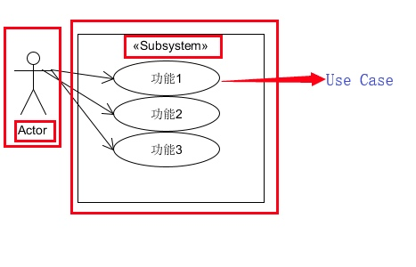
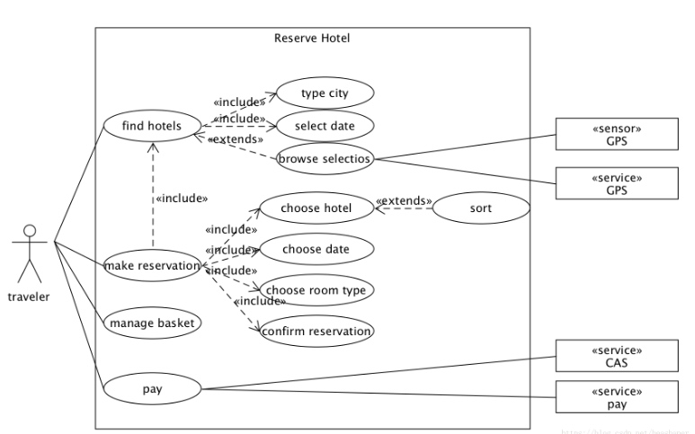
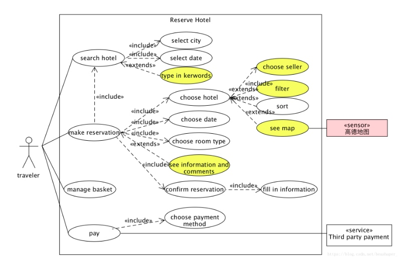
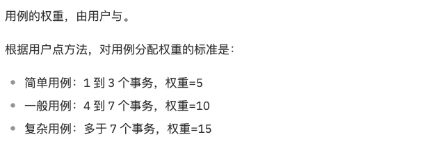
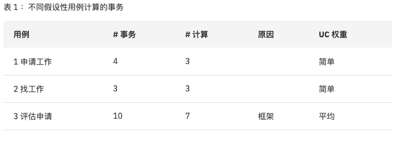

# 系统设计与分析第四次作业

## 简答题
### 用例的概念
* 用例，是软件工程或系统工程中对系统如何反应外界请求的描述，是一种通过用户的使用场景来获取需求的技术

### 用例和场景的关系？什么是主场景或 happy path？
* 用例是是一组相关的成功和失败的场景，这些场景是用于描述一个actor使用系统去support一个目标
* 问题中提到的主场景应该是指主成功场景，这是用例最基本的组成部分，它描述了满足涉众关注点的典型成功路径。
* 主场景通常不包括任何条件或分支，这是为了保持连贯性，并且将所有的条件处理都延迟到扩展部分。通常一个用例具有一个基本流和多个例外流。

### 用例有哪些形式？
* 简短模式(Brief)
    * 简洁的一段式概要，通常用于主成功场景
    * 在早期需求分析过程中使用，目的是为了快速了解主题和范围。可能只需要几分钟进行编写
* 简便格式(Casual)
    * 非正式的段落格式。用几个段落覆盖不同场景
* 详细描述(Fully)
    * 详细编写所有步骤及各种变化，同时具有补充部分，如前置条件和成功保证
    * 在确定并以摘要形式写出那些大量用例后，在第一次需求讨论会中，详细地编写其中少量的具有重要架构意义和高价值的用例

### 对于复杂业务，为什么编制完整用例非常难？
* 在整个用例编写过程当中，因为有些问题最好是作为非功能性需求在补充规格说明中描述，而不是直接在用例中说明，所以理想路径与扩展场景相结合只可能尽可能满足“几乎”所有涉众所关注的问题。
* 由于业务的复杂性，在简单的需求讨论和短时间的开发迭代中，一定无法覆盖整个业务的所有需求，因此用例的增加也只能覆盖大部分已出现的情形，而无法完全覆盖所有情景，也就“不完整”。同时，用例可能会遗漏一些关键信息或包含错误的陈述。

### 什么是用例图？
* 用例图是一种优秀的系统语境图，它可以展示系统边界、位于边界之外的事物以及系统如何被使用。同时，用例图可以作为沟通的工具，用以概括系统及其参与者的行为。

### 用例图的基本符号与元素？
用例图主要用来描述用户、需求、系统功能单元之间的关系。用例图的基本符号及元素如下所示：
* 参与者:表示与系统或程序进行交互的用户、组织或外部系统。
* 用例:外部可用的系统功能，对系统提供的服务进行描述。
* 子系统:用来展示系统的一部分功能，这部分功能一般具有紧密的联系。

* 关系:用例图中涉及到的关系包括关联、泛化、包含、扩展。
    * 关联:说明了参与者与用例之间的通信，任何一方都可以发送或接受信息，箭头指向的是消息的接收方
    * 泛化:就是通常理解的继承关系，子用例继承了父用例的所有结构、行为和关系，同时表现出更特别的行为。子用例可以选择使用或者重载父用例的一段行为，而父用例一般是抽象的。
    * 包含:包含关系用来把一个较复杂用例所表示的功能分解成较小的步骤，箭头指向分解出来的功能用例，旁边需要显式写出该关系《include》
    * 扩展:扩展关系是指当前用例功能的延伸，相当于给当前基础样例提供附加的功能。箭头指向原来的基础样例。

        | 关系类型 | 说明 |
        | :-: | :-: |
        | 关联 | 参与者与用例间的关系 |
        | 泛化 | 参与者之间或用例之间的关系 |
        | 包含 | 用例之间的关系 |
        | 扩展 | 用例之间的关系 |

### 用例图的画法与步骤
* 确定参与者，包括:
    * 主要参与者:谁将使用系统的主要功能、谁将需要系统的支持以完成工作等
    * 协作参与者:谁将提供对应的系统功能、谁将维护系统，保证系统处于工作状态等
    * 幕后参与者:谁会对系统产生的结果感兴趣
* 根据用户需求识别和创作用例，主要重点在于:
    * 参与者希望系统提供什么样的功能
    * 系统具有哪些功能,如是否支持存储和检索信息
    * 系统对应的功能由哪些参与者触发
    * 当系统状态改变时,参与者是否会得到通知
    * 参与者与事件的对应关系
    * 是否存在影响系统的外部事件
* 确认用例间的关系，包括关联、包含、扩展和泛化
* 根据上面已经确定的关系已经用例图规范进行用例图的绘制，可以借助例表来详细说明一个较复杂的用例

### 用例图给利益相关人与开发者的价值有哪些？
* 用例强调了用户的目标和观点，使得用户能够更多地参与到系统的设计当中去，保证系统按照用户的需求进行设计。而用例图则将用例图形化、具象化了，使得整个系统中用例、参与者之间的关系更加清晰地表达出来。
* 用例能够根据需要对复杂程度和形式化程序进行增减调节，即能够响应用户提出的需求，而用例图则使得这种调节更加便利，可以通过修改图形间的关系实现。
* 用例图使得开发者能够更明确地获得需求，更好地理解需求。
* 用例图可以指导开发和测试，同时可以在整个过程中对其他工作流起到指导作用。

## 建模练习题(用例模型)

### 为什么相似系统的用例图是相似的？
因为相似的系统中，用户预期的功能都是相似的，即不同的同类系统一定具有一致基本功能以及带有自己特色的扩展功能。以酒店预订系统为例，使用该系统的用户一般提供时间、地点、价格等信息，利用系统来搜索出符合信息的房间并进行预定，因此所有的系统都需要包括这样的功能，才能够满足用户的需求。因此，相似的系统一定会有相似的功能，也就具有相似的actor、use case和associate，因此也就具有相似的用例图。

### 如果是定旅馆业务，请对比 Asg_RH 用例图，简述如何利用不同时代、不同地区产品的用例图，展现、突出创新业务和技术，如何利用用例图定位创新思路（业务创新、或技术创新、或商业模式创新）在系统中的作用。
* 可以从时代特性和对应的用户需求出发。如现在是一个快节奏的时代，用户追求效率和便利的操作。对比airbnb和asg_rh，airbnb的操作无疑更加简单快捷，且具有一个更优秀的过滤系统，提供了多种条件来供用户对房源进行过滤，使得用户更高效地挑选到自己心仪的房源，很大程度地提升了用户的使用体验。
* 从业务创新出发。对比传统的酒店预定系统只能够预定房间，airbnb考虑到了用户属性的多样性，即他们本身也可能具有闲置的房源，扩充了软件使用者的属性，使user可以在租客和租户的身份之间自由切换，提供了更多的功能选择。
* 从用户信息保护和反馈出发。首先，airbnb较传统的订旅馆业务而言，对用户的信息作出了更好的保护，如只有在预定房间之后才知道房间的准确定位，这无疑是对民宿类的房间信息有了更好的保护。其次，airbnb提供了双向的评价，即用户和提供住宿的组织在完成一次交易后是互相评价的，这样有效地筛选出了优质的用户和租赁方。
* 从吸引用户的角度出发。airbnb通过合理分析用户的上传数据，提供了一些“猜你喜欢”的功能以及活动奖励，有效地提升了用户粘性以及软件对用户的吸引力。

### 请使用 SCRUM 方法，选择一个用例图，编制某定旅馆开发的需求（backlog）开发计划表

| ID | Name | Imp | Est  | How to Demo | Notes |
| :-: | :-: | :-: | :-: | :-: | :-: |
| 1 | 搜索旅店 | 80 | 20 | 填写城市、入住及离店日期、关键字进行搜索 | 搜索框中的每一表项预先设置一个默认值,用户可以对搜索结果进行筛选与排序 |
| 2 | 预订房间 | 100 | 25 | 选择旅店、选择卖家、选择日期、房间类型及数量，然后提交订单 | 应只可选择可预定的房间，已满的日期和房型给予提示 |
| 3 | 确认订单 | 60 | 10 | 填写入住信息，包括个人资料及联系方式等 | 必填有效证件号码与联系方式,注意对用户信息的保护 |
| 4 | 付款 | 60 | 15 | 选择付款方式，进行付款 | 尽量提供较多的第三方支付系统，支付失败及时给出反馈信息,注意对用户信息的保护 |
| 5 | 管理订单 | 40 | 10 | 可以查看已支付的订单信息、取消订单 | 取消订单需经卖家同意后退款 |

### 根据任务4，参考使用用例点估算软件成本，给出项目用例点的估算

从以上阅读材料中表格所演示的情况，我们根据任务4给出样例点的估算：

| 用例 | 业务 | 计算 | 原因  | UC比重 |
| :-: | :-: | :-: | :-: | :-: |
| 搜索旅店 | 6 | 3 |  | 平均 |
| 预订房间 | 4 | 2 |  | 平均 |
| 确认订单 | 2 | 2 |  | 简单 |
| 付款 | 2 | 2 |  | 简单 |
| 管理订单 | 2 | 1 |  | 简单 |

    