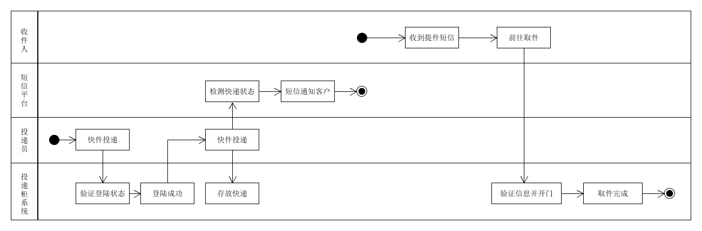

# 系统设计与分析第七次作业
## 根据订旅馆建模文档[Asg-RH.pdf](https://sysu-swsad.github.io/swad-guide/material/Asg_RH.pdf)
### 绘制用例图模型
首先我们根据文档，可以简单归纳出以下的用例和子用例的结构关系：
* 查找旅馆
    * 选择目的地
    * 选择入住日期
    * 选择退房日期
    * 将搜索结果排序
* 预定旅馆
    * 选择旅馆(包括查看房间详情)
    * 选择房间
    * 确认预定(包括填写用户信息且相关预定加入购物车)
* 购物车
    * 添加商品
    * 检查商品信息
    * 移除商品
* 支付
    * 选择支付方式(调用外部API)
    * 完善账户信息
    
    
### 给出make reservation用例的活动图

 

## 根据课程练习“投递员使用投递箱给收件人快递包裹”的业务场景
### x科技公司发明了投递柜，它们自建了投递柜以及远程控制系统。注册的投递员在推广期免费使用投递柜。由于缺乏资源，仅能使用y移动平台向客户发送短信通知。

### 场景2：随着产品推广，x公司与各大快递z公司达成协议。x公司在快递柜上添加了二维码扫描装置，z公司的快递员不仅可在快递柜上登陆（由z公司提供认证服务），且可扫描快递单号，投递入柜后自动由z公司发短信给客户。客户取件后，自动发送给z公司投递完成。

### 场景3：x公司进一步优化服务，开发了微信小程序实现扫码取快递。如果用户关注了该公司公众号，直接通过过公众号推送给用户取件码等信息。不再发送短信。

### 根据上述流程，给出快递柜系统最终的用例图模型

    