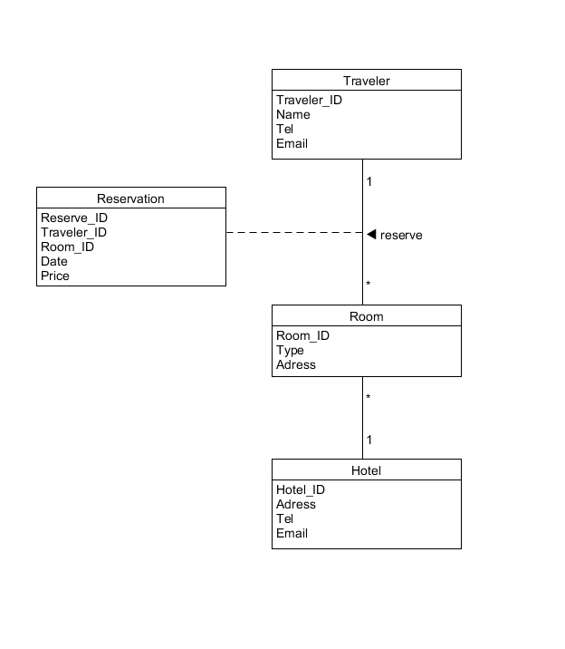
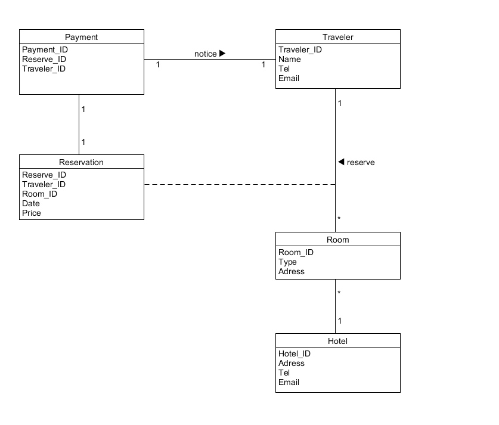
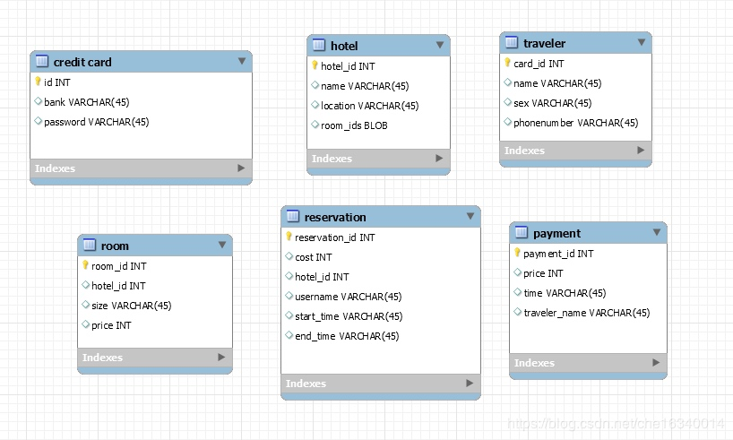
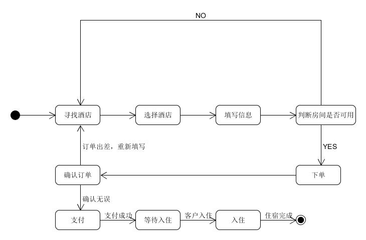

# 系统分析与设计第六次作业
## 使用类图，分别对 [Asg-RH.pdf](https://sysu-swsad.github.io/swad-guide/material/Asg_RH.pdf) 文档中 Make Reservation 用例以及 Payment 用例开展领域建模。然后，根据上述模型，给出建议的数据表以及主要字段，特别是主键和外键

* 注意事项：
    * 对象必须是名词、特别是技术名词、报表、描述类的处理；
    * 关联必须有多重性、部分有名称与导航方向
    * 属性要注意计算字段
* 数据建模，为了简化描述仅需要给出表清单，例如：
    * Hotel（ID/Key，Name，LoctionID/Fkey，Address…..）

    
### Make Reservation领域图

### Payment领域图

### 数据表主要字段

## 使用 UML State Model，对每个订单对象生命周期建模
* 建模对象： 参考 [Asg-RH.pdf](https://sysu-swsad.github.io/swad-guide/material/Asg_RH.pdf) 文档， 对 Reservation/Order 对象建模。
* 建模要求： 参考练习不能提供足够信息帮助你对订单对象建模，请参考现在 定旅馆 的旅游网站，尽可能分析围绕订单发生的各种情况，直到订单通过销售事件（柜台销售）结束订单。

### Order/Reservation对象建模

